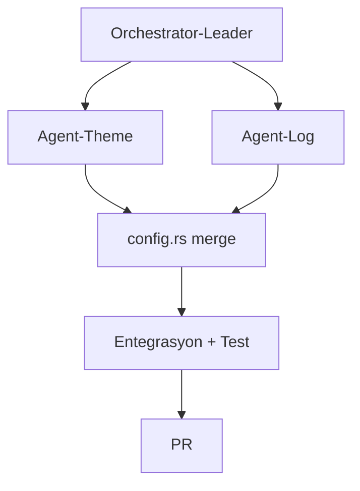

# grainx Phase 3 — Paralel Ajan Orkestrasyonu

## Lider: Orchestrator-Leader

**Rol:** Görev dağıtımı, arayüz sözleşmeleri, çakışma çözümü, entegrasyon, test ve PR.

| Sorumluluk | Açıklama |
|------------|----------|
| Planlama | Phase 3 görevlerini bağımsız modüllere ayırır |
| Sözleşme | Worker'lar arası config alanlarını tanımlar |
| Entegrasyon | Worker çıktılarını tek branch'te birleştirir |
| Doğrulama | `cargo test`, `cargo check` çalıştırır |
| PR | Sonuçları draft PR olarak açar |

## Worker Ajanlar

### Agent-Theme (Renk Teması)
- **Görev:** `ColorTheme` config desteği + UI renk eşlemesi
- **Dosyalar:** `src/theme.rs`, `src/config.rs`, `src/ui.rs`, `src/help.rs`, `src/input.rs`
- **Commit:** `2a505bd`

### Agent-Log (Metrik Loglama)
- **Görev:** Periyodik metrik yazımı `grainx_metrics.log`
- **Dosyalar:** `src/logging.rs`, `src/config.rs`, `src/main.rs`
- **Commit:** `15a865c`, `3287e1a`

## Orkestrasyon Akışı



## Config Sözleşmesi (Leader tarafından tanımlandı)

```json
{
  "color_theme": "default",
  "log_enabled": true,
  "log_path": "grainx_metrics.log",
  "log_interval_iterations": 10
}
```

## Durum

| Ajan | Görev | Durum |
|------|-------|-------|
| Orchestrator-Leader | Koordinasyon + entegrasyon | ✅ Tamamlandı |
| Agent-Theme | Renk teması | ✅ Tamamlandı |
| Agent-Log | Metrik loglama | ✅ Tamamlandı |

## Sonuç

- **63/63 test geçti**
- Temalar: `default`, `dark`, `light`, `high_contrast`
- Log formatı: `timestamp,cpu_percent,memory_used,memory_total,network_rx,network_tx`
- Branch: `cursor/phase3-orchestration-23d2`
